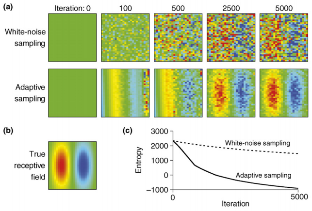
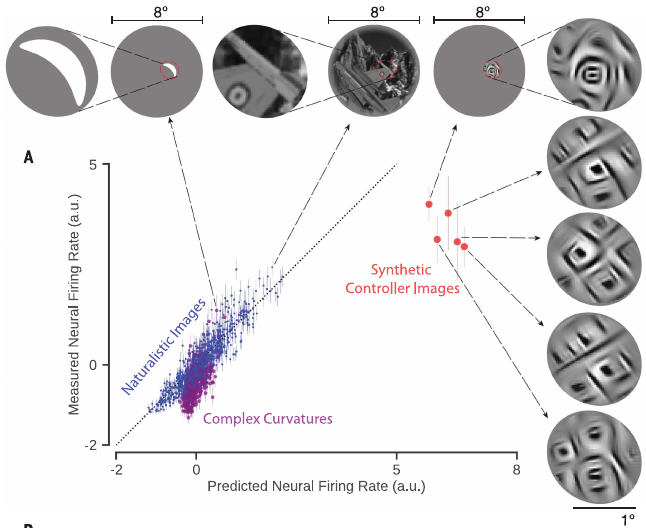

# What gets your neurons going?

 1. Walker 2019: Inception loops discover what excites neurons most using deep predictive models
 2. Ponce 2019: Evolving images for visual neurons using a deep generative network reveals coding principles and neuronal preferences
 3. Bashivan 2019: Neural population control via deep image synthesis

### Tim Sit

### 2020 July 10

<!--v-->

## The paper

<iframe src="./pdfs/williams2018unsupervised.pdf"
width="100%" height=800>
</iframe>

<!--h-->

## Outline

 1. History and background: Receptive fields and finding good stimuli
 2. Machine learning-based approaches to find the most exciting stimuli
 3. Results
 4. Discussion and applications

<!--h-->

## 1 | Receptive fields and finding good stimuli

*What is a receptive field?*

 1. Sherrington 1906: A receptive field is an area of the body surface where a stimulus could elicit a reflex.
 2. Hartline 1938: Receptive field is a region of visual space where light shone on the retina can drive electrical response in a retinal ganglion cell

This idea is now extended to other senses: sounds, smells, taste etc.
Time dimension is also sometimes considered: spatiotemporal receptive fields (eg. direction selective responses in primary visual cortex (V1))

[Scholarpedia: receptive field](http://www.scholarpedia.org/article/Receptive_field#Sherrington1906)

 <!-- .element  width="100%"--> <!-- .element: class="fragment current-visible" data-fragment-index="1" -->

 <!-- .element  width="100%"--> <!-- .element: class="fragment current-visible" data-fragment-index="2" -->

<!--h-->

## Previous approaches to finding receptive fields

 1. Turning circular spots of light on and off
 2. Other shapes: innovation of rectangular bars!
 3. ...
 4. Gaussian white noise
 5. Active learning approaches
 6. Natural images
 7. Model-driven approach : small parameter space
 8. Model-driven approach : many parameters (eg. deep neural networks)

(also normative models, energy models, etc...)

 

See:

[Wikipedia page on feature detectors](https://en.wikipedia.org/wiki/Feature_detection_(nervous_system))

Horace Barlow (1953) recording from frog retina - on-off ganglion cells that respond to transition from light to dark / dark to light at a specific range of visual angles (posited as fly detectors) <!-- .element  width="100%"--> <!-- .element: class="fragment current-visible" data-fragment-index="1" -->

Hubel and Wisel (1959) recording from straite cortex of cats <!-- .element  width="100%"--> <!-- .element: class="fragment current-visible" data-fragment-index="2" -->

Froudarakis1 et al (2014) Population code in mouse V1 facilitates readout of
natural scenes through increased sparseness <!-- .element  width="100%"--> <!-- .element: class="fragment current-visible" data-fragment-index="5" -->

Generating images through placement of 4 points to egnerate Bezier spline segments. Carlson et al (2011) A sparse object coding scheme in Area V4. <!-- .element  width="100%"--> <!-- .element: class="fragment current-visible" data-fragment-index="6" -->

 <!-- .element  width="100%"--> <!-- .element: class="fragment current-visible" data-fragment-index="1" -->

 <!-- .element  width="100%"--> <!-- .element: class="fragment current-visible" data-fragment-index="2" -->

 <!-- .element  width="100%"--> <!-- .element: class="fragment current-visible" data-fragment-index="3" -->

 <!-- .element  width="100%"--> <!-- .element: class="fragment current-visible" data-fragment-index="4" -->

 <!-- .element  width="100%"--> <!-- .element: class="fragment current-visible" data-fragment-index="5" -->

 <!-- .element  width="100%"--> <!-- .element: class="fragment current-visible" data-fragment-index="6" -->

<!--h-->

<!--h-->

## 2 | Machine learning-based approaches to find the most exciting stimuli

<!--h-->

### Neural network models of vision

 <!-- .element  width="100%"-->

Two main operations:

 1. Convolution: spatial filters (eg. edge detectors)
 2. Pooling: taking the max or the average of all values from a portion of the filtered image (ie. spatial down-sampling)

 

 <!--v-->

### An interactive example of CNN

<iframe frameborder="0"  width="100%" height="700pt" src="https://poloclub.github.io/cnn-explainer/"></iframe>

<!--h-->

### Activation maps / Attribution

Olah et al 2018: The building blocks of interpretability

<iframe frameborder="0"  width="100%" height="700pt" src="https://distill.pub/2018/building-blocks/"></iframe>

<!--h-->

### How to find the most exciting stimuli?

 1. Present animal with large number of images <!-- .element: class="fragment fade-in-then-semi-out" data-fragment-index="1" -->
 2. Train a neural network to map the image to each neuron's response <!-- .element: class="fragment fade-in-then-semi-out" data-fragment-index="2" -->
 3. Using the function learned in (2), find the image that maximise the predicted response of the animal's neuron(s) <!-- .element: class="fragment fade-in-then-semi-out" data-fragment-index="3" -->

 

 

 

  <!-- .element  width="100%"--> <!-- .element: class="fragment current-visible" data-fragment-index="1" -->

Walker 2019: 5000 unique natural images x 1 Repeat. Plus 100 images x 10 repeats (to find reliable neurons) <!-- .element  width="100%"--> <!-- .element: class="fragment current-visible" data-fragment-index="1" -->

  <!-- .element  width="100%"--> <!-- .element: class="fragment current-visible" data-fragment-index="2" -->

   <!-- .element  width="100%"--> <!-- .element: class="fragment current-visible" data-fragment-index="3" -->

  

  Gradient ascent method to maximise predicted neural response <!-- .element  width="100%"--> <!-- .element: class="fragment current-visible" data-fragment-index="3" -->

  

   <!-- .element  width="100%"--> <!-- .element: class="fragment current-visible" data-fragment-index="4" -->

 

<!--v-->

### How to find the most exciting stimuli?

 1. Train neural network on large database of images (eg. ImageNet)
 2. Present a large number of images to the animal, and learn a function that maps the response of the animal to the response of the trained neural network in (1)
 3. Using the function learned in (2), find the image that maximise the predicted response of the animal's neuron(s)

 

 <!-- .element  width="60%"-->

Bashivan 2019's NN: trained on the LSVRC-2010 ImageNet database (1.3 million images)

<!--v-->

## Results

<!--h-->

<!--v-->

<iframe src="./pdfs/williams2020combining.pdf"
width="100%" height=800>
</iframe>

<!--v-->

<iframe border=0 frameborder=0 height=500 width=550
src="https://twitframe.com/show?url=https%3A%2F%2Ftwitter.com%2FSuryaGanguli%2Fstatus%2F1202637594606981120"
</iframe>

<!--h-->

## 3 | Results

<!--h-->

### Summary of the Papers

| Paper | Location | Technique |  Algorithm | Type of control | Behaviour accounted for?
|-------|----------|-----------|-----------|-----------------|------|
| Walker 2019 | Mouse V1 | 2P | DNN directly from image to neural | Offline. Maximise single neuron activity | Yes
| Ponce 2019 | Macaque IT + V1 | Ephys | Genetic algorithm + something | Online. (a) Maximise sigle neuron activity (b) Maximise average activity | No |
| Bashivan 2019 | Macaque V4 | Ephys | Pre-trained DNN + Mapping DNN to neural | Offline. (a) Maximise single neuron activity (b) Maximise single neuron activity + suppress all other neurons | No

<!--h-->

#### Walker 2019 : Most exciting inputs don't like traditional gabours

 <!-- .element  width="100%"--> <!-- .element: class="fragment" data-fragment-index="1" -->

Most exciting inputs found for one mouse (each neuron has it's own most exciting input) <!-- .element: class="fragment fade-in-then-semi-out" data-fragment-index="1" -->

 <!-- .element  width="100%"--> <!-- .element: class="fragment" data-fragment-index="2" -->

Each neuron respond most specifically to their most exciting input (focus on the diagonal) <!-- .element: class="fragment fade-in-then-semi-out" data-fragment-index="2" -->

<!--h-->

#### Walker 2019 : Most exciting inputs are indeed most exciting most of the time

 <!-- .element  width="50%"--> <!-- .element: class="fragment" data-fragment-index="1" -->

- MEI = Most exciting input
- RF = MEI found using the same deep CNN but removing all nonlinearity (except the last one) (ie. a very big linear-nonlinear model)
- Gabour = Best gabour stimuli found using grid-search
- Masked natural image = Natural image constrained to match size, constrast and location of MEI (searched over 5000 images)

 <!-- .element  width="80%"--> <!-- .element: class="fragment" data-fragment-index="2" -->

- each dot is a neuron

<!--v-->

## Each neuron's most exciting input is stable across days

<!--v-->

## Details about the gabour grid-search

$$
I_\text{Gabour}(x, y) = \exp \left( -\frac{1}{2\sigma^2} ((x - \mu_x)^2 + (y - \mu_y)^2)) \right) \cos \left( \frac{2\pi}{\lambda} (x \cos\theta + y \sin \theta) + \phi \right)
$$

Where:

 - $\mu_x$ control the horizontal center of the Gabour
 - $\mu_y$ control the vertical center of the Gabour
 - $\theta$ control the orientation
 - $\lambda$ control the spatial frequency
 - $\phi$ control the phase of the grating

<!--h-->

## Ponce 2019: You can also maximise average firing rate of all neurons (and do it live!)

The evolving image approach allows you to optimise most exciting inputs within an experiment.

Evolving images to maximise firing rate across all 32 sites of electrode array implanated in the inferior temporal cortex of Macaque monkeys.

| Monkey | Increase in spike/s (median) | P(neuron) with increase in firing rate |
|--------|------------------------------|-------------------------|
| Ri     | 9.4                          | 61%                     |
| Gu     | 30.7                         | 93%                     |
| Y1     | 27.8                         | 99.5%                   |

No graph for this for some reason...

<!--v-->

## Ponce 2019: Distance of natural image from best synthetic image in neural-network space predicts neuron's firing rate to image

<!--h-->

## Bashivan 2019: You can excite one neuron whilst suppressing others

 <!-- .element  width="80%"--> <!-- .element: class="fragment" data-fragment-index="1" -->

  <!-- .element  width="80%"--> <!-- .element: class="fragment" data-fragment-index="2" -->

Q:Can you do any arbitrary state vector? <!-- .element: class="fragment" data-fragment-index="3" -->

<!--h-->

## Discussion and applications

 1. Superstimulus
 2. Peak shift principle

<!--h-->

## Further reading

<!--h-->

## End

